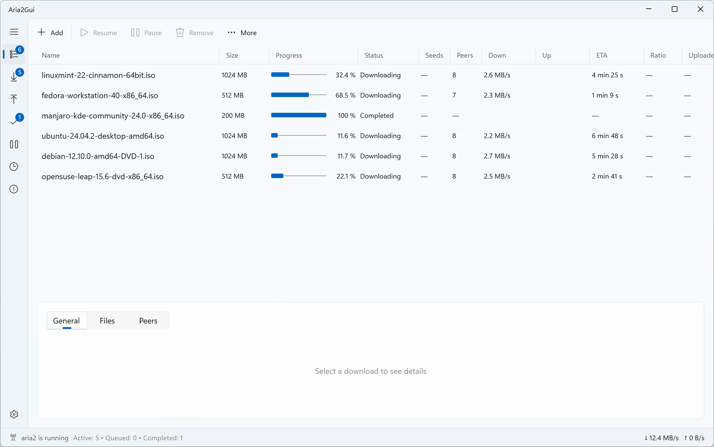
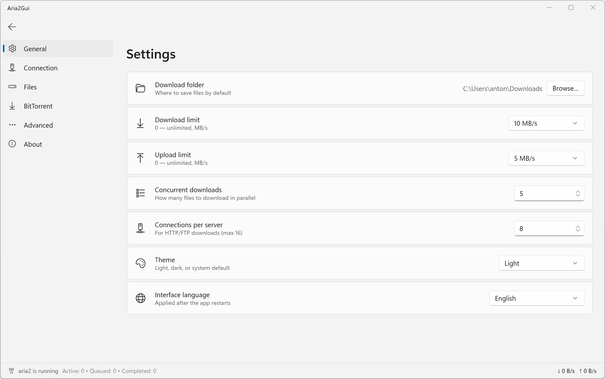
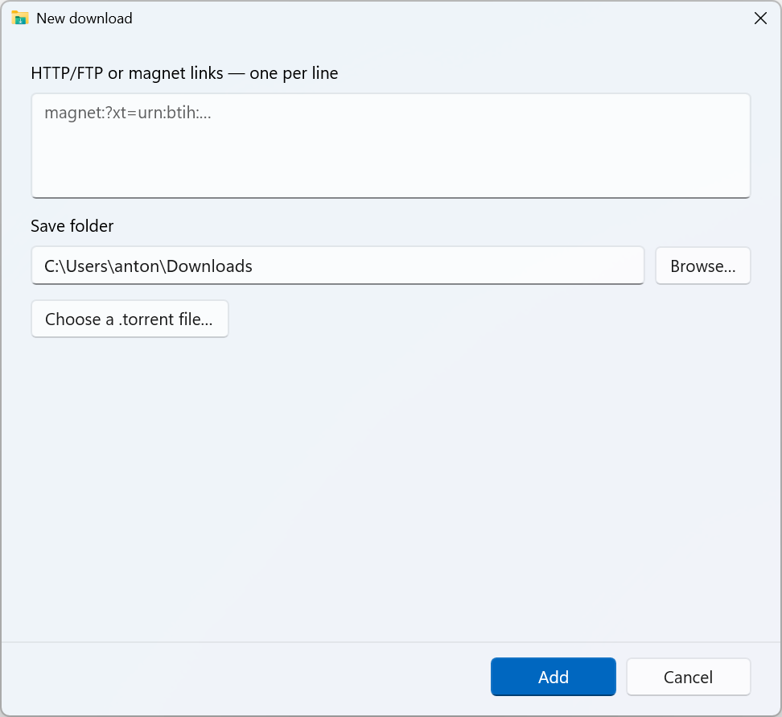

# Aria2Gui

[English](README.md) · **Русский**

Быстрый **портативный** менеджер загрузок и торрентов для Windows - аккуратный десктоп-интерфейс в стиле qBittorrent для движка [aria2](https://aria2.github.io/), на **WinUI 3**.

Без установки и зависимостей: распакуй и запусти. Движок aria2, среда .NET и Windows App SDK уже внутри.



## Возможности

- **Раскладка в стиле qBittorrent** - боковая панель фильтров по статусу, сортируемая таблица загрузок (имя, размер, прогресс, статус, сиды/пиры, скорость загрузки/отдачи, ETA, рейтинг) с изменяемыми колонками и панель деталей (Общие / Файлы / Пиры).
- **Добавление загрузок** - ссылки HTTP/FTP и magnet (по одной в строке) и/или файл `.torrent`, со сворачиваемым **деревом выбора файлов** (папки, выбрать всё / ничего) - качай только нужное.
- **Мгновенные настройки** - в стиле Windows 11: каждое изменение применяется и сохраняется сразу, без кнопки «Сохранить». Папка загрузок, лимиты скорости, число одновременных загрузок, соединения, прокси, таймауты/повторы, выделение места под файл, BT-порт, DHT/PEX/LPD, шифрование (с уровнем), макс. пиров, рейтинг раздачи, доп. трекеры и произвольные опции aria2.
- **12 языков** - English, Русский, Español, Deutsch, Français, Português (BR), Italiano, 中文 (简体), 日本語, Українська, Polski, Türkçe - переключаются прямо в приложении (работает и в портативной сборке).
- **Системный трей** - свернуть в трей, развернуть, пауза для всех, выход; живая подсказка о загрузках.
- **Drag & drop** - перетащи ссылки или `.torrent` прямо в окно.
- **Темы** - системная / светлая / тёмная, на подложке Mica.
- **По-настоящему портативный** - self-contained; запускается из любой папки или с флешки. Настройки и сессия aria2 хранятся в папке `data\` рядом с exe. Один экземпляр на копию (два GUI повредили бы общий файл сессии).

## Скриншоты

| Настройки | Добавление загрузки |
| :---: | :---: |
|  |  |

## Скачать

Возьми свежий `Aria2Gui-portable-win-x64.zip` со страницы [**Releases**](../../releases), распакуй в любое место и запусти `Aria2Gui\Aria2Gui.exe`.

**Требования:** Windows 10 версии 1809 (сборка 17763) или новее, 64-бит (x64). Ничего устанавливать не нужно - среда .NET 10, Windows App SDK и движок aria2 лежат внутри папки.

## Сборка из исходников

Нужны: [.NET 10 SDK](https://dotnet.microsoft.com/download), Windows 10 SDK, инструментарий WinUI / Windows App SDK и включённый режим разработчика.

```powershell
git clone https://github.com/vidrug/aria2-winui3.git
cd aria2-winui3

# портативный self-contained релиз x64
dotnet publish Aria2Gui/Aria2Gui.csproj -c Release -p:PublishProfile=win-x64-portable -p:Platform=x64
# результат: publish\Aria2Gui\   ->  запускай Aria2Gui.exe
```

Для повседневной разработки открой проект в Visual Studio 2022 (17.10+) с компонентом Windows App SDK или собери и запусти через инструменты WinUI.

## Технологии

- **WinUI 3** / Windows App SDK 2.1
- **.NET 10** (C#), MVVM через [CommunityToolkit.Mvvm](https://github.com/CommunityToolkit/dotnet)
- Контролы CommunityToolkit WinUI (SettingsControls, Sizers)
- **aria2 1.36** - встроенный движок, управляется по WebSocket JSON-RPC на случайном loopback-порту
- Локализация через ресурсы MRT `.resw`, резолвящиеся через явный контекст с привязкой к выбранному языку - поэтому выбор языка работает даже в unpackaged/портативной сборке (где штатный резолв `x:Uid` иначе застревает на языке ОС)

## Локализация

Строки интерфейса лежат в `Aria2Gui/Strings/<язык>/Resources.resw` (12 языков). Текст XAML локализуется через attached-свойство `loc:Localize.Uid`, а код - через хелпер `L`; оба резолвятся через контекст, привязанный к сохранённому языку. Чтобы улучшить перевод - отредактируй нужный `.resw`; чтобы добавить новую строку - добавь её ключ во **все** языковые файлы. Переводы новых языков и правки приветствуются.

## Примечания

- aria2c запускается на приватном loopback-порту со случайным секретом и привязан к времени жизни GUI (Win32 Job Object + `--stop-with-process`), поэтому никогда не остаётся висеть после закрытия приложения.
- Сессия автосохраняется, поэтому незавершённые загрузки продолжаются при следующем запуске.

## Благодарности и сторонние компоненты

- **[aria2](https://aria2.github.io/)** - движок загрузок, встроен как `aria2c.exe`. aria2 распространяется под **GNU GPL v2 (или новее)**; в репозитории лежит немодифицированный официальный бинарь.
- **[Windows App SDK / WinUI 3](https://github.com/microsoft/WindowsAppSDK)** и **[.NET Community Toolkit](https://github.com/CommunityToolkit)** (MIT).
